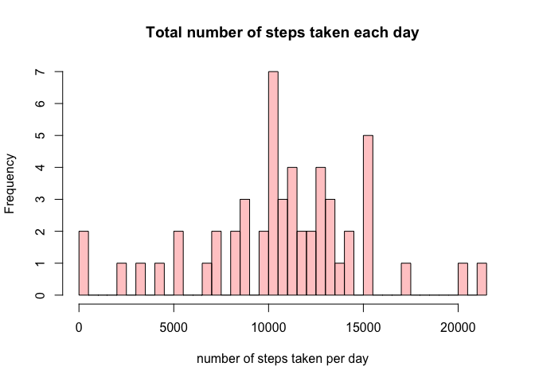
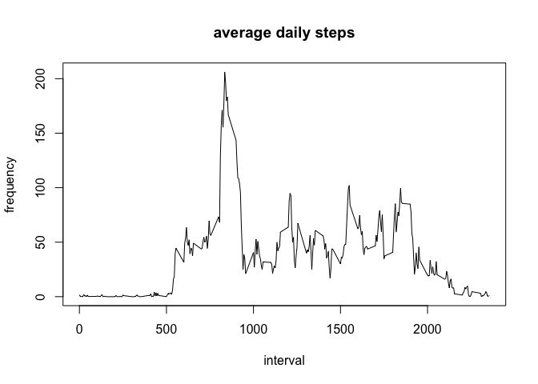
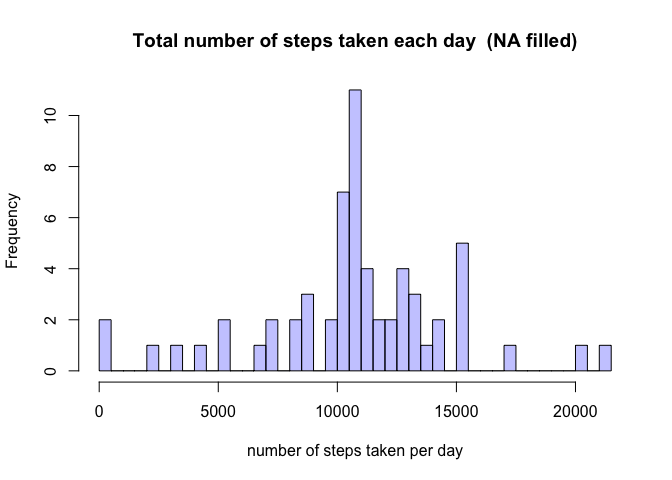
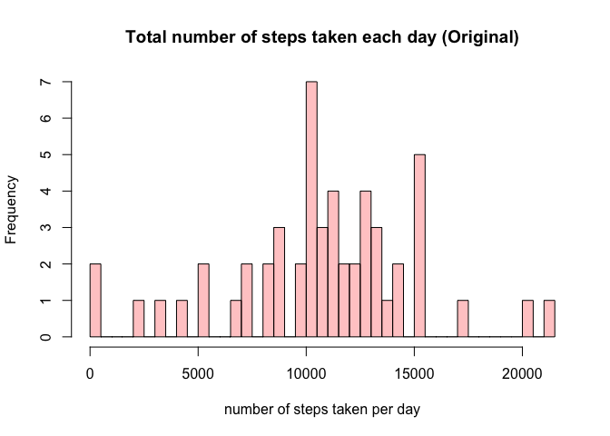
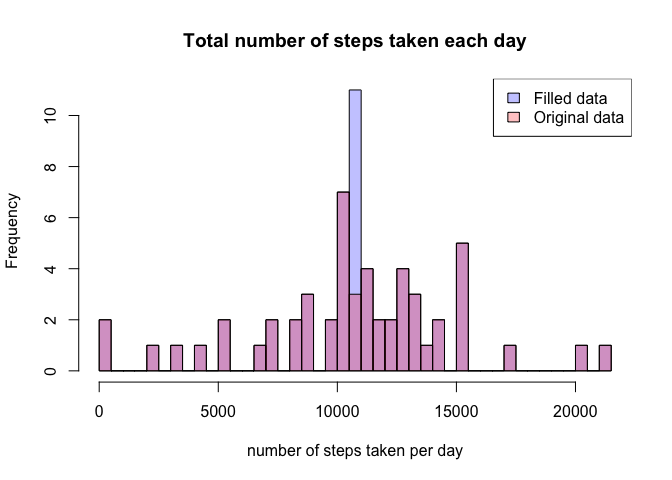
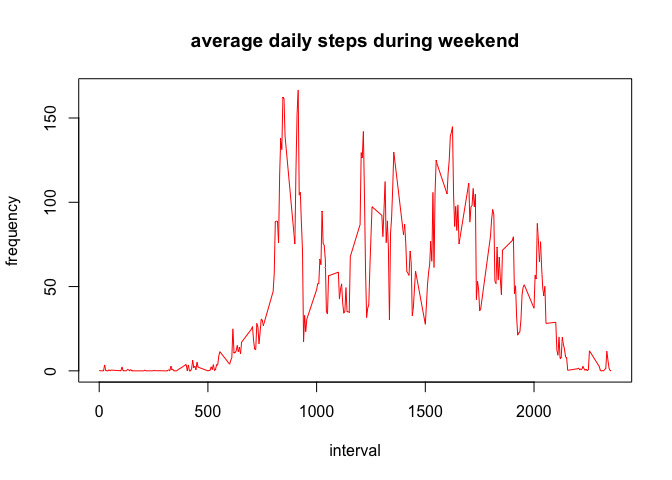

# Peer Assessment 1
Michiko  
June 12, 2015  

##Loading and preprocessing the data

```r
data <- read.csv("activity.csv")
```


##What is mean total number of steps taken per day?

1. total steps per day

```r
tspd <- data.frame(tspd=tapply(data$steps,data$date,sum)) 
```

2. plot a histogram 

```r
hist(tspd$tspd,breaks=50,xlab="number of steps taken per day", 
    main="Total number of steps taken each day", col=rgb(1,0,0,1/4))
```

 

3. mean and median of the total number of steps taken per day

```r
mean(tspd$tspd,na.rm=T)
```

```
## [1] 10766.19
```

```r
median(tspd$tspd,na.rm=T)
```

```
## [1] 10765
```


##What is the average daily activity pattern?
1. calculate average steps by interval

```r
tspdi <- data.frame(tspdi=tapply(data$steps,list(data$interval),mean,na.rm=T)) 
plot(y=tspdi$tspdi,x=row.names(tspdi), type="l",main="average daily steps",xlab="interval",ylab="frequency")
```

 

2. which interval contains the maximum number of steps?

Change order (high --> low); the colum number shown below contains the highest value

```r
ord <- order(tspdi,decreasing=T)
ord1 <- ord[1]
tspdi[ord1,]
```

```
##      835 
## 206.1698
```

##Imputing missing values
1. total number of missing values in the dataset 

```r
sum(is.na(data$steps))
```

```
## [1] 2304
```

2. filling in all of the missing values in the dataset & 3. create a new dataset taht is equal to the original dataset but with the missing data filled in 

Using mean of interval to fill the missing values

```r
data_fill <- data
data_fill$steps <- ifelse(is.na(data_fill$steps)==T,tspdi$tspdi,data$steps)
```

4. Make a histogram of the total number of steps taken each day and Calculate and report the mean and median total number of steps taken per day. Do these values differ from the estimates from the first part of the assignment? What is the impact of imputing missing data on the estimates of the total daily number of steps?

total number of steps per day

```r
tspd_fill <- data.frame(tspd=tapply(data_fill$steps,data_fill$date,sum)) 
```

Compare the two plots

  

Plot the two in one graph

```r
plot(hist2, col=rgb(0,0,1,1/4),xlab="number of steps taken per day", 
    main="Total number of steps taken each day")  
plot(hist1, col=rgb(1,0,0,1/4),add=T) 
legend("topright", legend = c("Filled data","Original data"),
       bg = "transparent", fill = c(rgb(0,0,1,1/4),rgb(1,0,0,1/4)))
```

 

mean and median

```r
mean(tspd_fill$tspd,na.rm=T)
```

```
## [1] 10766.19
```

```r
median(tspd_fill$tspd,na.rm=T)
```

```
## [1] 10766.19
```

The original data's mean and median are;

```r
mean(tspd$tspd,na.rm=T)
```

```
## [1] 10766.19
```

```r
median(tspd$tspd,na.rm=T)
```

```
## [1] 10765
```


Interpretation  
Since the compliment was done by using the average values of the original data, the mean and median values are almsot identical between the original and the filled data.
However, the comparison graph shows that there is a big gap between the two data. The gap is seen around the mean of the number of trips teken per day, since, again, the compliment was done by using the averaged numbers. The filling approach taken in this assignment has a minimal effect to the mean and median of the data; however, it might overestimate some cases, espeially cases with the average number of steps.

##Are there differences in activity patterns between weekdays and weekends?
1.Create a new factor variable in the dataset with two levels – “weekday” and “weekend” indicating whether a given date is a weekday or weekend day.


```r
wkdy_list <- weekdays(as.Date(data_fill$date))
wkdy <- data_fill
wkdy$wkdy <- ifelse(wkdy_list=="Sunday"|wkdy_list=="Saturday","weekend","weekday")
```

2. Make a panel plot containing a time series plot (i.e. type = "l") of the 5-minute interval (x-axis) and the average number of steps taken, averaged across all weekday days or weekend days (y-axis).

```r
wkdyi <- data.frame(tapply(wkdy$steps,list(wkdy$interval,wkdy$wkdy),mean,na.rm=T)) 
plot(y=wkdyi$weekend,x=row.names(wkdyi), type="l",main="average daily steps during weekend",xlab="interval",ylab="frequency", col="red")
```

 

```r
plot(y=wkdyi$weekday,x=row.names(wkdyi), type="l",main="average daily steps during weekday",xlab="interval",ylab="frequency", col="blue")
```

 


